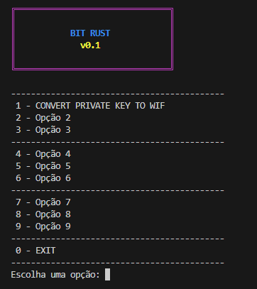

# BitRust
Bitcoin Puzzle Wallets

<br/>

<p align="center">
  
</p>

<p align="center">
  
</p>


<br/>

## How to Use

### Build and Run the Project

1. Open a terminal and navigate to your project folder.

2. To compile and run the project, execute the following command:

### Build and Run

```bash
  # Windows
   ./build_and_run.bat

  #Linux
  chmod +x build-and-run.sh
  ./build-and-run.sh
```

---

```
src/
├── main.rs               
├── menu_task.rs              
│
├── data/                  
│   └── ranges.rs           
│
├── modules/             
│   └── wif_generate.rs
│   └── desafio_info.rs
│   └── private_to_public_key.rs
│   └── address_generate.rs
│
├── utils/
│   └── utils.rs
│
├── .gitignore
├── Cargo.toml
├── LICENSE
├── README.md
├── screenshot.png
```